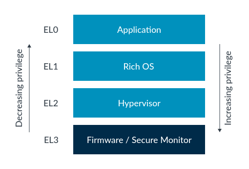
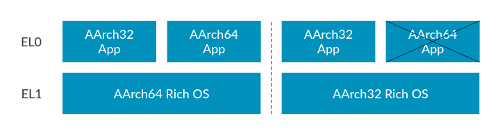
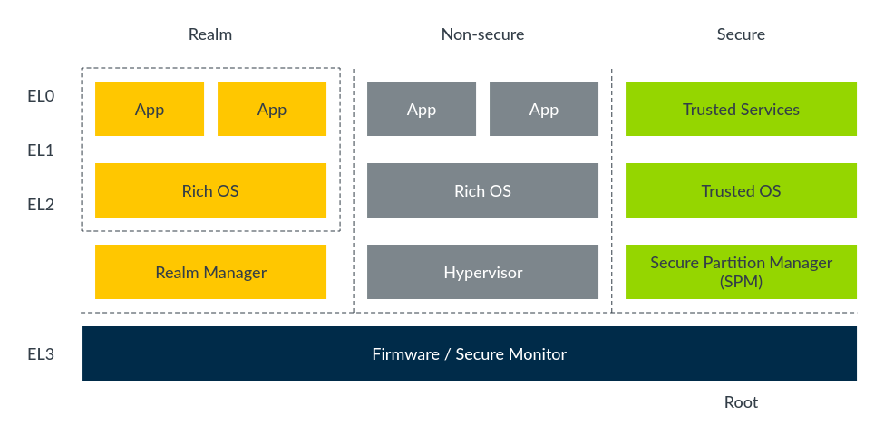

## Privilege and Exception levels

Before we explain the details of the AArch64 Exception model, we need to introduce the concept of privilege.

Modern software is developed to be split into different modules, each with a different level of access to system and processor resources. An example of this is the split between the operating system kernel and user applications. The operating system needs to perform actions which we do not want a user application to be able to perform. The kernel needs a high level of access to system resources, whereas user applications need limited ability to configure the system. Privilege dictates which processor resources a software entity can see and control.

The AArch64 architectures enable this split by implementing different levels of privilege. The current privilege level can only change when the processor takes an exception or returns from an exception. Therefore, these privilege levels are referred to as Exception levels in the Arm architecture.

### Exception levels

The name for privilege in AArch64 is Exception level, often abbreviated to EL. The Exception levels are numbered, normally abbreviated and referred to as `EL<x>`, where `<x>` is a number between 0 and 3. The higher the level of privilege the higher the number. For example, the lowest level of privilege is referred to as EL0.

As shown in Exception levels, there are four Exception levels: EL0, EL1, EL2 and EL3.

Figure 1. Exception levels

The architecture does not specify what software uses which Exception level. A common usage model is application code running at EL0, with a rich Operating System (OS) such as Linux running at EL1. EL2 may be used by a hypervisor, with EL3 used by firmware and security gateway code. For example, Linux can call firmware functions at EL3, using software interface standards, to abstract the intent from the lower-level details for powering on or off a core. This model means the bulk of PE processing typically occurs at EL0/1.

> Note The architecture does not enforce this software model, but standard software assumes this model. For this reason, the rest of this guide assumes this usage model.

The Exception level can only change when any of the following occur:

- Taking an exception
- Returning from an exception
- Processor reset
- During Debug state
- Exiting from Debug state

When taking an exception the Exception level can increase or stay the same. You can never move to a lower privilege level by taking an exception. When returning from an exception the Exception level can decrease or stay the same. You can never move to a higher privilege level by returning from an exception. We discuss this further in later sections of this guide.

### Types of privilege

There are two types of privilege relevant to the AArch64 Exception model:

- Privilege in the memory system
- Privilege from the point of view of accessing processor resources

Both types of privilege are affected by the current privileged Exception level.

#### Memory privilege

The A-profile of the Arm architecture implements a virtual memory system, in which a Memory Management Unit (MMU) allows software to assign attributes to regions of memory. These attributes include read/write permissions that can be configured to allow separate access permissions for privileged and unprivileged accesses.

Memory access initiated when the processor is executing in EL0 are checked against the unprivileged access permissions. Memory accesses from EL1, EL2, and EL3 are checked against the privileged access permissions.

Because this memory configuration is programmed by software using the MMU’s translation tables, you should consider the privilege necessary to program those tables. The MMU configuration is stored in System registers, and the ability to access those registers is also controlled by the current Exception level.

> Note In the Arm architecture, registers are split into two main categories:
> - Registers that provide system control or status reporting
> - Registers that are used in instruction processing, for example to accumulate a result, and in handling exceptions

##### Register access

Configuration settings for AArch64 processors are held in a series of registers known as System registers. The combination of settings in the System registers defines the current processor context. Access to the System registers is controlled by the current Exception level.

For example, `VBAR_EL1` is the Vector Base Address Register. We will describe what it is used for later in this guide. For now, what is important is the `_EL1` suffix. This tells us that software needs at least EL1 privilege to access the register.

The architecture has many registers with conceptually similar functions that have names that differ only by their Exception level suffix. These are independent, individual registers that have their own encodings in the instruction set and will be implemented separately in hardware.

The registers have similar names to reflect that they perform similar tasks, but they are entirely independent registers with their own access semantics. The suffix of the System register name indicates the lowest Exception level from which that register can be accessed.

There is a System Control Register (SCTLR) for each implemented Exception level. Each register controls the architectural features for that EL, such as the MMU, caches and alignment checking:

###### SCTLR_EL1
    Top-level system control for EL0 and EL1
###### SCTLR_EL2
    Top-level system control for EL2
###### SCTLR_EL3
    Top-level system control for EL3

> Note EL1 and EL0 share the same MMU configuration and control is restricted to privileged code running at EL1. Therefore there is no `SCTLR_EL0` and all control is from the EL1 accessible register. This model is generally followed for other control registers.

Higher Exception levels have the privilege to access registers that control lower levels. For example, EL2 has the privilege to access `SCTLR_EL1` if necessary. This register cannot be accessed from EL0, and any attempt to do so generates an exception.

In the general operation of the system, the privileged Exception levels control their own configuration. However, more privileged levels sometimes access registers associated with lower Exception levels. For example, this could be to implement virtualization features and context switching.

The following System registers are discussed in relation to the AArch64 Exception model in this guide:

**Table 1. Key System registers when handling exceptions**
| Register | Name | Description |
| --- | --- | --- |
| Exception Link Register | ELR_ELx | Holds the address of the instruction which caused the exception |
| Exception Syndrome Register | ESR_ELx | Includes information about the reasons for the exception | 
| Fault Address Register | FAR_ELx | Holds the virtual faulting address |
| Hypervisor Configuration Register | HCR_ELx |  Controls virtualization settings and trapping of exceptions to EL2 |
| Secure Configuration Register | SCR_ELx | Controls Secure state and trapping of exceptions to EL3 |
| System Control Register | SCTLR_ELx | Controls standard memory, system facilities, and provides status information for implemented functions |
| Saved Program Status Register | SPSR_ELx | Holds the saved processor state when an exception is taken to this ELx |
| Vector Base Address Register | VBAR_ELx | Holds the exception base address for any exception that is taken to ELx |
> 上面的信息有个不太准确的地方，就是 SCR_ELx,  但是理论上只有 EL3 才会控制 SCR 寄存器，所以理论上应该只有一个 SCR_EL3, 不可能存在 SRC_EL1, 或者 SCR_EL2

------------------------------------------------

## Execution and Security states

The AArch64 architecture provides four Exception levels. There are also two Execution states and up to four Security states. The current state of an Armv8-A or Armv9-A processor is determined by the Exception level and the current Execution state.

### Execution states

The current Execution state defines the standard width of the general-purpose register and the available instruction sets. The Execution state also affects aspects of the memory models and how exceptions are managed.

Armv8-A and Armv9-A support two Execution states:

- AArch32
> AArch32 is a 32-bit Execution state. Operation in this state is backward compatible with previous architectures. It supports the T32 and A32 instruction sets. The standard register width is 32 bits.
- AArch64
> AArch64 is a 64-bit Execution state. It supports the A64 instruction set. The standard register width is 64 bits.

The later chapters in this guide focus in more depth on how exceptions are handled in AArch64.

#### Changing Execution state

A Processing Element (PE) can only change Execution state on reset or when the Exception level changes. When the PE moves between Exception levels it is possible to change Execution state, however transitioning between AArch32 and AArch64 is only allowed subject to additional rules:

- When moving from a lower Exception level to a higher level, the Execution state can stay the same or change to AArch64.
- When moving from a higher Exception level to a lower level, the Execution state can stay the same or change to AArch32.

Putting these two rules together means that a 64-bit layer can host a 32-bit layer, but not the other way around. For example, a 64-bit OS kernel can host both 64-bit and 32-bit applications, while a 32-bit OS kernel can only host 32-bit applications.

The following diagram illustrates these scenarios:

Figure 1. Exception levels on 32- and 64-bit layers

In this example we have used an OS and applications, but the same rules apply to all Exception levels. For example, a 32-bit hypervisor at EL2 could only host a 32-bit OS at EL1.

The Armv8-A architecture supports AArch32 and AArch64 Execution state at all Exception levels. It is an implementation choice to support either or both for each Exception level.

For Armv8-A processors, the Execution state on reset is determined by an IMPLEMENTATION DEFINED mechanism. For example, Cortex-A32 always resets into AArch32 state.

For Armv9-A processors, AArch64 is required to be supported at all ELs. It is an implementation choice whether to support AArch32 at EL0. All other Exception levels are AArch64, and on reset the Execution state is always AArch64.

The Execution state of each Exception level is defined by the control register at the next higher implemented Exception level. This utilizes the Hypervisor Configuration Register (HCR_EL2) at EL2 and the Secure Configuration Register (SCR_EL3) at EL3. At reset, if switchable, EL3 execution is set by an external pin. This topic is covered further in the section on Routing and interrupt controllers.

### Security states

AArch64 allows for the implementation of multiple Security states. This allows a further partitioning of software to isolate and compartmentalize trusted software.

Most Cortex-A processors support two Security states:

**Secure state**
    In this state, a Processing Element (PE) can access both the Secure and Non-secure physical address spaces, and the Secure copy of banked registers.
**Non-secure state**
    This is often also referred to as Normal world. In this state, a PE can only access the Non-secure physical address space. The PE can only access System registers that allow non-secure accesses.

The Security state defines which of the implemented Exception levels can be accessed, which areas of memory can currently be accessed, and how those accesses are represented on the system memory bus. If in Non-secure state, the PE can only access the Non-secure physical address space. In Secure state, the PE can access both the Secure and Non-secure physical address spaces.

An example of this would be to have your operating system, such as Android, running in the Normal world, with a payment or DRM system running in the Secure world. We need a higher degree of trust in the Secure world systems and need to keep them separate to protect information such as payment details and keys. Having the two security states provides this separation.

This diagram shows the Exception levels and Security states, with different Execution states being used:

Figure 1. Exception levels and Security states using different Execution states

The uses of these Security states are described in more detail in our guide TrustZone for AArch64.

#### Changing Security state

If TrustZone is implemented then the processor can be in either Secure state or Non-secure state. This is selected by the SCR_EL3.NS bit.

You may have noted in the previous diagram that EL3 is in Secure state. EL3 is the most privileged Exception level and the Security state of EL3 is fixed. EL3 is able to access all copies of a banked System register.

In Armv8-A EL3 is always in Secure state. In Armv9-A, EL3 is part of Secure state unless RME is implemented. If RME is implemented, Root state is a separation of EL3 from the rest of Secure state. RME is covered more in the next section.

Whenever you want to switch from one Security state to another you must pass through EL3. Software at EL3 is responsible for managing access to the different available Security states and acts as a gatekeeper, controlling access to the Security states of EL2, EL1 and EL0. The SCR_EL3.NS bit enables a change of Security state on return from EL3.

> Note  At EL0, EL1, and EL2 the PE can be in either Secure state or Non-secure state. You often see this written as:
> - NS_EL1: Non-secure state, Exception level 1
> - S_EL1: Secure state, Exception level 1

Changing Security state is discussed in more detail in TrustZone for AArch64 and Realm Management Extension.

#### Realm Management Extension

Armv9-A introduced support for the Realm Management Extension (RME). When RME is implemented, two additional Security states are supported:

Realm state: In this state a PE can access Non-secure and Realm physical address spaces.
Root state: In this state a PE can access all physical address spaces. Root state is only available in EL3.
RME isolates EL3 from all other Security states. With RME, EL3 moves out of Secure state and into its own Security state called Root. Exception level 3 hosts the platform and initial boot code and therefore must be trusted by the software in Secure, Non-secure, and Realm states.

The following diagram shows the Security states in an RME-enabled PE, and how these Security states map to Exception levels:

Figure 2. Security states in an RME-enabled PE

For more information on RME, see the Realm Management Extension.

### Impact of implemented Exception levels

It is an implementation choice whether all Exception levels are implemented, and which Execution states are allowed for each implemented Exception level, for any specific processor.

EL0 and EL1 are the only Exception levels that must be implemented and are mandatory. EL2 and EL3 are optional.

Please note that if EL3 or EL2 have not been implemented the following should be considered:

EL2 contains much of the virtualization functionality. Implementations that do not have EL2 do not have access to these features. For more on virtualization see the AArch64 virtualization guide.
EL3 is the only level that can change Security state. If an implementation chooses not to implement EL3, that PE would only have access to a single Security state. The state you are permanently in is therefore IMPLEMENTATION DEFINED.
There are several software implementations that have been developed requiring platforms to support these Exception levels. For example, KVM Linux requires EL2, EL1, and EL0.

Note
In Armv8.0-A, EL2 only existed in Non-secure state because there was no virtualization support in Secure state. Armv8.4-A added S.EL2 as an optional feature with an enable bit (SCR_EL3.EEL2) to give backwards compatibility. In Armv9-A, if you support EL2 you must support it in both Security states, however the disable bit is still present.

An Armv8-A processor implementation can choose which Execution states are valid for each Exception level and this is IMPLEMENTATION DEFINED. If AArch32 is allowed at an Exception level, it must be allowed at all lower Exception levels. For example, if EL3 allows AArch32, then it must be allowed at all lower Exception levels.

Many implementations allow all Executions states and all Exception levels, but there are existing implementations with limitations. For example:

Cortex-A35 supports AArch32 and AArch64 at all Exception levels
Cortex-A32 only supports AArch32
Neoverse-N2 supports AArch32 at EL0. All other Exception levels are AArch64 only.
AArch32 provides backwards compatibility with the old 32-bit architecture, and from Armv9-A is restricted to optional implementation only at EL0. Armv9-A supports AArch64 at all Exception levels and only optionally supports AArch32 at EL0. This means that legacy applications can be run, but not kernels, hypervisors, or firmware.

You should refer to the Technical Reference Manual (TRM) of your processor to check what Exception levels are supported.

-------------------------------------------------

## Exception types

Exceptions are conditions or system events that usually require remedial action or an update of system status by privileged software to ensure smooth functioning of the system. An exception is therefore any event that can cause the currently executing program to be suspended. Taking an exception causes a change in state to execute code to handle that exception.

Figure 1. Handling an exception

