## Arm GIC fundamentals
In this section, we look at the basic operation of the Arm GICv3 and v4 interrupt controllers.

### Interrupt types
The GIC can deal with four different types of interrupt sources:

- Shared Peripheral Interrupt (SPI). Peripheral interrupts that can be delivered to any connected core.
- Private Peripheral Interrupt (PPI). Peripheral interrupts that are private to one core. An example of a PPI is an interrupt from the Generic Timer.
- Software Generated Interrupt (SGI). SGIs are typically used for inter-processor communication and are generated by a write to an SGI register in the GIC.
- Locality-specific Peripheral Interrupt (LPI). LPIs were first introduced in GICv3 and have a very different programing model to the other three types of interrupt. The configuration of LPIs is covered in the Arm CoreLink Generic Interrupt Controller v3 and v4: Locality-specific Peripheral Interrupts guide.

Each interrupt source is identified by an ID number, which is referred to as an `INTID`. The interrupt types that are introduced in the preceding list are defined in terms of ranges of INTIDs:

| INTID | Interrupt Type | Notes | 
| --- | --- | --- |
| 0 - 15 | SGIs | Banked per PE |
| 16 - 31  1056 - 1119 (GICv3.1) | PPIs | Banked per PE | 
| 32 - 1019  4096 - 5119 (GICv3.1) | SPIs | – |
| 1020 - 1023 | Special interrupt number | Used to signal special cases, see Settings for each PE for more information. |
| 1024 - 8191 | Reserved | – |
| 8192 and greater | LPIs | The upper boundary is IMPLEMENTATION DEFINED |

### How interrupts are signaled to the interrupt controller
Traditionally, interrupts are signaled from a peripheral to the interrupt controller using a dedicated hardware signal, as shown in the following image:

Figure 1. Dedicated interrupt signal

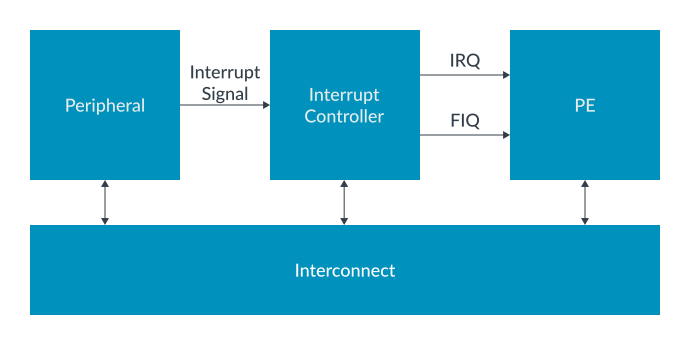

Arm CoreLink GICv3 supports this model, but also provides an additional signaling mechanism: message-signaled interrupts (MSI). MSIs are transmitted by a write to a register in the interrupt controller, as you can see here:

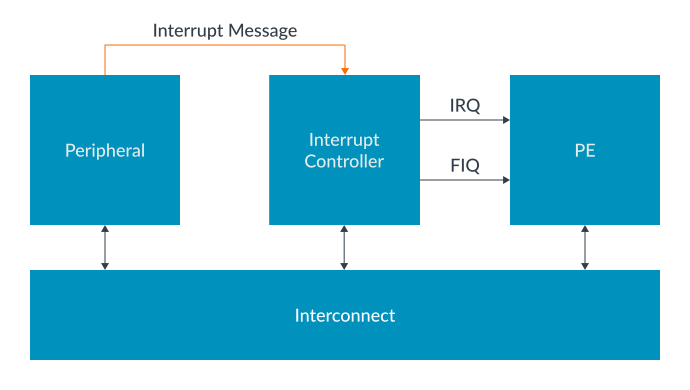

Using a message to forward the interrupt from a peripheral to the interrupt controller removes the requirement for a dedicated signal for each interrupt source. This can be an advantage for designers of large systems, where potentially hundreds or even thousands of signals might be routed across an SoC and converge on the interrupt controller.

Whether an interrupt is sent as a message or using a dedicated signal has little effect on the way that the interrupt handling code handles the interrupt. Some configuration of the peripherals might be required. For example, it might be necessary to specify the address of the interrupt controller. This peripheral configuration is beyond of the scope of this guide.

In Arm CoreLink GICv3, SPIs can be message-signaled interrupts. LPIs are always message-signaled interrupts. Different registers are used for the different interrupt types, as shown in the following table:

| Interrupt Type | Registers |
| --- | --- |
| SPI | GICD_SETSPI_NSR asserts an interrupt  GICD_SETSPI_NSR asserts an interrupt |
| LPI | GITS_TRANSLATER |

### Interrupt state machine
The interrupt controller maintains a state machine for each SPI, PPI, and SGI interrupt source. This state machine consists of four states:

- Inactive. The interrupt source is not currently asserted.
- Pending. The interrupt source has been asserted, but the interrupt has not yet been acknowledged by a PE.
- Active. The interrupt source has been asserted, and the interrupt has been acknowledged by a PE.
- Active and Pending. An instance of the interrupt has been acknowledged, and another instance is now pending.

> Note LPIs have a simpler state machine. See Taking an interrupt for more information.

The state machine is shown in the following diagram:

Figure 3. Interrupt state machine

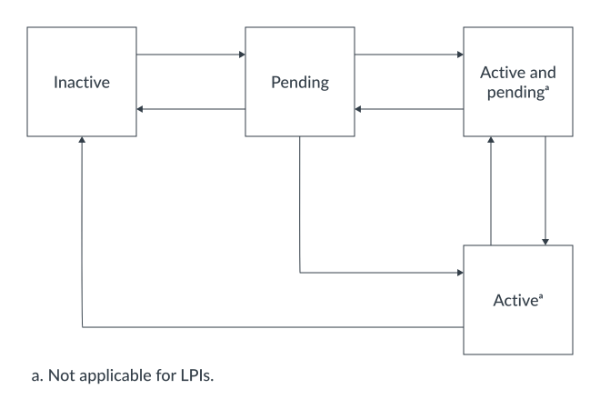

The life cycle of an interrupt depends on whether it is configured to be level-sensitive or edge-triggered:

- For level-sensitive interrupts, a rising edge on the interrupt input causes the interrupt to become pending, and the interrupt is held asserted until the peripheral de-asserts the interrupt signal.
- For edge-sensitive interrupts, a rising edge on the interrupt input causes the interrupt to become pending, but the interrupt is not held asserted.

#### Level sensitive interrupts
The following diagram shows how the interrupt state transitions correspond to the interrupt signal:

Figure 4. Timing level sensitive

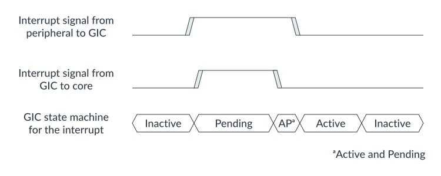

Considering each state transition in turn:

- Inactive to pending. An interrupt transitions from inactive to pending when the interrupt source is asserted. At this point the GIC asserts the interrupt signal to the PE, if the interrupt is enabled and is of sufficient priority.
- Pending to active and pending. An interrupt transitions from pending to active and pending when a Processor Element (PE) acknowledges the interrupt by reading one of the Interrupt Acknowledge Registers (IARs) in the CPU interface. This read is typically part of an interrupt handling routine that executes after an interrupt exception is taken. At this point the GIC de-asserts the interrupt signal to the PE.
- Active and pending to active. An interrupt transitions from active and pending to active when the peripheral de-asserts the interrupt signal. This typically happens in response software writing to a status register in the peripheral.
- Active to inactive. An interrupt goes from active to inactive when the PE writes to one of the End of Interrupt Registers (EOIRs) in the CPU interface. This indicates that the PE has finished handling the interrupt.

#### Edge-triggered interrupts
The following diagram shows how the interrupt state transitions correspond to the interrupt signal:

Figure 5. Timing edge-triggered

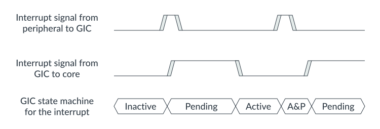

Considering each state transition in turn:

- Inactive to pending. An interrupt transitions from inactive to pending when the interrupt source is asserted. At this point the GIC asserts the interrupt signal to the PE, if the interrupt is enabled and is of sufficient priority.
- Pending to active. An interrupt transitions from pending to active when a PE acknowledges the interrupt by reading one of the IARs in the CPU interface. This read is typically part of an interrupt handling routine that executes after an interrupt exception is taken. However, software can also poll the IARs. At this point the GIC de-asserts the interrupt signal to the PE.
- Active to active and pending. An interrupt goes from active to active and pending if the peripheral re-asserts the interrupt signal.
- Active and pending to pending. An interrupt goes from active and pending to pending when the PE writes to one of the EOIRs in the CPU interface. This indicates that the PE has finished handling the first instance of the interrupt. At this point the GIC re-asserts the interrupt signal to the PE.

### Target interrupts
The Arm architecture assigns each PE a hierarchal identifier that is called an affinity. The GIC uses affinity values to target interrupts at a specific core.

An affinity is a 32-bit value that is split into four fields:

<affinity level 3>.<affinity level 2>.<affinity level 1>.<affinity level 0>

The affinity of a PE is reported in `MPIDR_EL1`.

The exact meaning of the different levels of affinity is defined by the specific processor and SoC. For example, Arm Cortex-A53 and Arm Cortex-A57 processors use:

<group of groups>.<group of processors>.<processor>.<core>

Later designs, like those used in Arm Cortex-A55 and Arm Cortex-A76 processors, use:

<group of processors>.<processor>.<core>.<thread>

It is highly unlikely that all the possible nodes exist in a single implementation. For example, an SoC for a mobile device could have a layout like this:

`0.0.0.[0:3]` Cores 0 to 3 of a Cortex-A53 processor

`0.0.1.[0:1]` Cores 0 to 1 of a Cortex-A57 processor

> Note  AArch32 state, and Armv7-A, can only support three levels of affinity. This means that a design that uses AArch32 state is limited to a single node at affinity level 3 (0.x.y.z). GICD_TYPER.A3V indicates whether the interrupt controller can support multiple level 3 nodes.

### Security model
The Arm GICv3 architecture supports Arm TrustZone technology. Each `INTID` must be assigned a group and security setting by software. GICv3 supports three combinations of settings, as you can see in the following table:

| Interrupt Type | Example use |
| --- | --- |
| Secure Group 0 | Interrupts for EL3 (Secure Firmware) |
| Secure Group 1 | Interrupts for Secure EL1 (Trusted OS) |
| Non-secure Group 1 | Interrupts for the Non-secure state (OS or Hypervisor) |

`Group 0` interrupts are always signaled as `FIQs`. Group 1 interrupts are signaled as either `IRQs` or `FIQs`, depending on the current Security state and Exception level of the PE, as you can see here:

| EL and Security state of PE | Group 0 | Group 1 | Group 1    |
| ---                         | ---     | ---     | ---        |
| 	                          |         | Secure  | Non-secure |
| Secure EL0/1                | FIQ     | IRQ     | FIQ        |
| Non-secure EL0/1/2          | FIQ     | FIQ     | IRQ        |
| EL3                         | FIQ     | FIQ     | FIQ        |

These rules are designed to complement the AArch64 security state and Exception level routing controls. The following diagram shows a simplified software stack, and what happens when different types of interrupt are signaled while executing at EL0:

Figure 6. Interrupt routing example

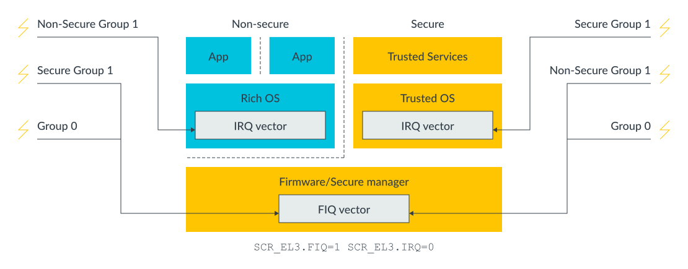

In this example, IRQs are routed to EL1 (SCR_EL3.IRQ==0) and FIQs routed to EL3 (SCR_EL3.FIQ==1) . Considering the rules described above, while executing at EL1 or EL0 a Group 1 interrupt for the current Security state is taken as an IRQ.

An interrupt for the `other Security` state triggers an `FIQ`, and the exception is taken to EL3. This allows software executing at EL3 to perform the necessary `context switch`.

> FIQ本身就是用于跨security state传输使用的，这个 FIQ 当中的 F 就是 fordwarding的意思，意思就是转发，  对于 group-1来说 -> 当我们当前是 non-secure, 然后中断目标是 secure, 那么生成的中断就是 FIQ; 或者当前是 secure, 然后中断目标是 non-secure, 那么生成的中断就是 FIQ， 同样的还是对于group-1来说，当我们当前是 secure, 然后中断target还是secure, 那么生成的中断就是 IRQ; 或者当前是 non-secure, 然后中断目标是 secure, 那么生成的中断就是 IRQ;  也就是说对于 group-1来说，同态的就是 IRQ, 跨态的就是 FIQ，   对于group-0来说的话，就全部都是 FIQ 了

### Impact on software
> Note When the Armv9-A Realm Management Extensions is implemented, the GIC treats Realm state is treated as an extension of non-secure state.

Software controls the allocation of INTIDs to interrupt groups when configuring the interrupt controller. Only software executing in Secure state can allocate INTIDs to interrupt groups.

Typically, only software executing in Secure state should be able to access the settings and state of Secure interrupts: Group 0 and Secure Group 1.

Accesses from Non-secure state to Secure interrupt settings and state can be enabled. This is controlled individually for each INTID, using the `GICD_NSACRn` and `GICR_NSACR` registers.

> Note LPIs are always treated as Non-secure Group 1 interrupts.

### Support for single Security state
GICv3 supports the Arm TrustZone technology, but the use of TrustZone is OPTIONAL. This means that you can configure your implementation to have either a single Security state or two Security states:

- GICD_CTLR.DS == 0 Two Security states, Secure and Non-secure, are supported.
- GICD_CTLR.DS == 1 Only a single Security state is supported.

Configure the GIC to use the same number of Security states as the attached PEs. Typically, this means that the GIC will support two Security states when connected to Arm Cortex-A profile processors and one Security state when connected to Arm Cortex-R profile processors.

### Programmer’s model
The register interface of a GICv3 interrupt controller is split into three groups:

- Distributor interface
- Redistributor interface
- CPU interface
> 因此我们控制GICv3时，控制的也是这3组寄存器, 这3组寄存器的名字都是和自身的特性相关:  `GICD_*` ,  `GICR_*` ,  `ICC_*_ELn`  但是实际上Distributor寄存器都是基于Memory mapped, 因此Distributor寄存器是没有具体的名称的，只是有规范，我们访问的时候还是基于内存地址来访问

These interfaces are illustrated in the following diagram:

Figure 7. Programming interfaces

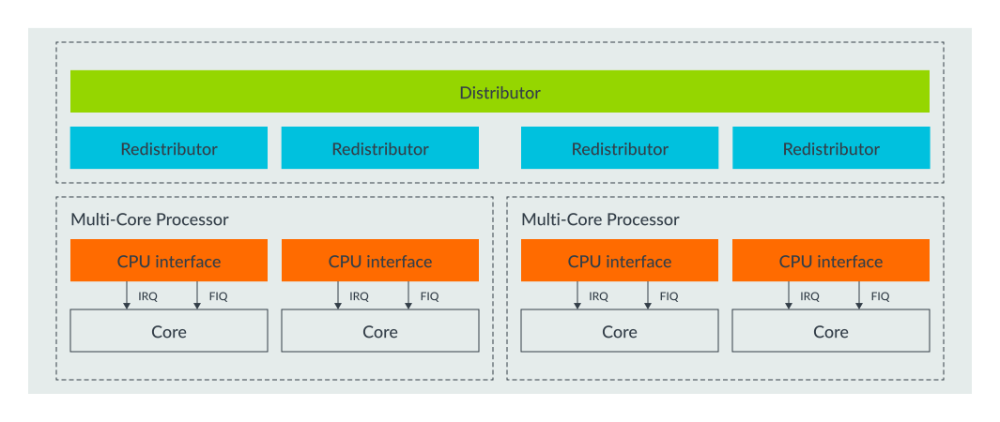

In general, the Distributor and the Redistributors are used to configure interrupts, and the CPU interface is used to handle interrupts.

### Distributor
The Distributor registers are `memory-mapped` and used to configure `SPIs`. The Distributor provides a programming interface for:

- Interrupt prioritization and distribution of SPIs
- Enable and disable SPIs
- Set the priority level of each SPI
- Route information for each SPI
- Set each SPI to be level-sensitive or edge-triggered
- Generate message-signaled SPIs
- Control the active and pending state of SPIs
- Determine the programmer’s model that is used in each Security state: affinity routing or legacy.

### Redistributors
There is one Redistributor per connected core. The Redistributors provide a programming interface to:

- Enable and disable SGIs and PPIs
- Set the priority level of SGIs and PPIs
- Set each PPI to be level-sensitive or edge-triggered
- Assign each SGI and PPI to an interrupt group
- Control the state of SGIs and PPIs
- Control the base address for the data structures in memory that support the associated interrupt properties and pending state for LPIs
- Provide power management support for the connected PE

### CPU interfaces
Each core contains a CPU interface, which are system registers that are used during interrupt handling. The CPU interfaces provide a programming interface to:

- Provide general control and configuration to enable interrupt handling
- Acknowledge an interrupt
- Perform a priority drop and deactivation of interrupts
- Set an interrupt priority mask for the PE
- Define the preemption policy for the PE
- Determine the highest priority pending interrupt for the PE

In Arm CoreLink GICv3, the CPU Interface registers are accessed as System registers: `ICC_*_ELn`.

Software must enable the System register interface before using these registers. This is controlled by the `SRE` bit in the `ICC_SRE_ELn` registers, where n specifies the Exception level: EL1-EL3.

----------------------------------------------

## Configuring the Arm GIC
This section of the guide describes how to enable and configure a GICv3-compliant interrupt controller in a bare metal environment. For detailed register descriptions see the Arm Generic Interrupt Controller Architecture Specification GIC architecture version 3.0 and 4.

The configuration of Locality-specific Peripheral Interrupts (LPIs) is significantly different to the configuration of Shared Peripheral Interrupts (SPIs), Private Peripheral Interrupt (PPIs), and Software Generated Interrupts (SGIs), and is beyond the scope of this guide. To learn more, refer to our guide Arm CoreLink Generic Interrupt Controller v3 and v4: Locality-specific Peripheral Interrupts.

Most systems that use a GICv3 interrupt controller are multi-core systems, and possibly also multi-processor systems. Some settings are global, which means that affect all the connected PEs. Other settings are particular to a single PE.

Let’s look at the global settings, and then the settings for each PE.

### Global settings
The Distributor control register (`GICD_CTLR`) must be configured to enable the `interrupt groups` and to set the routing mode as follows:

- Enable Affinity routing (`ARE` bits): The ARE bits in `GICD_CTLR` control whether the GIC is operating in GICv3 mode or legacy mode. Legacy mode provides backwards compatibility with GICv2. This guide assumes that the ARE bits are set to 1, so that GICv3 mode is being used.
- Enables: GICD_CTLR contains separate enable bits for `Group 0`, `Secure Group 1` and `Non-secure Group 1`:
    - EnableGrp1S enables distribution of `Secure Group 1` interrupts.
    - EnableGrp1NS enables distribution of `Non-secure Group 1` interrupts.
    - EnableGrp0 enables distribution of `Group 0` interrupts.

> Note  Arm CoreLink GIC-600 does not support legacy operation, and the ARE bits are permanently set to 1.

### Settings for each PE
This section covers settings that are specific to a single core or PE.

#### Redistributor configuration
Each core has its own Redistributor, as shown here:

Figure 1. PE connected to redistributor

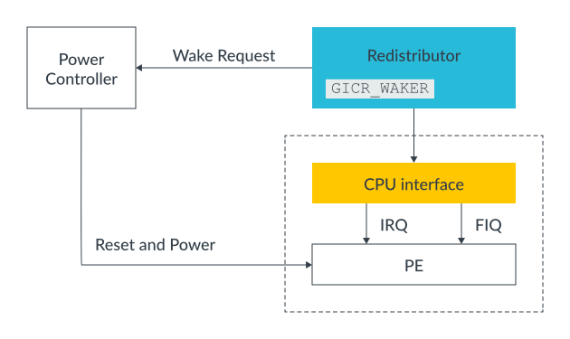

The Redistributor contains a register called `GICR_WAKER` which is used to record whether the connected PE is online or offline. Interrupts are only forwarded to a PE that the GIC believes is online. At reset, all PEs are treated as being offline.

To mark the connected PE as being online, software must:

- Clear GICR_WAKER.ProcessorSleep to 0.
- Poll GICR_WAKER.ChildrenAsleep until it reads 0.

It is important that software performs these steps before configuring the CPU interface, otherwise behavior can be UNPREDICTABLE.

While the PE is offline (`GICR_WAKER.ProcessorSleep==1`), an interrupt that is targeting the PE will result in a `wake-request signal` being asserted. Typically, this signal will go to the power controller of the system. The power controller then `turns on` the PE. On waking, software on that PE would clear the ProcessorSleep bit, allowing the interrupt that woke the PE to be forwarded.

> 通过上面的图片我们也可以看到，Power Controller wakeup PE 不是通过中断发生的，这是因为Power Controller 之所以wakeup PE的目的就是因为之前Redistributor 给PE发送中断时发现PE sleep了，所以Power Controller 才需要wakeup PE, 所以 Power Controller wakeup PE是通过非中断的方式来完成的

### CPU interface configuration
The CPU interface is responsible for delivering interrupt exceptions to the PE to which it is connected. To enable the CPU interface, software must configure the following:

Enable System register access: The CPU interfaces (`ICC_*_ELn`) section describes the CPU interface registers, and how they are accessed as System registers in GICv3. Software must enable access to the CPU interface registers, by setting the `SRE` bit in the `ICC_SRE_ELn` registers.

> Note Many recent Arm Cortex processors do not support legacy operation, and the SRE bits are fixed as set. On these processors this step can be skipped.

- Set `Priority Mask` and `Binary Point` registers: The CPU interface contains the Priority Mask register (`ICC_PMR_EL1`) and the `Binary Point registers` (`ICC_BPRn_EL1`). The Priority Mask sets the `minimum priority` that an interrupt must have in order to be forwarded to the PE. The Binary Point register is used for `priority grouping and preemption`. The use of both registers is described in more detail in **Handling Interrupts**.

- Set EOI mode: The EOImode bits in `ICC_CTLR_EL1` and `ICC_CTLR_EL3` in the CPU interface control how the completion of an interrupt is handled. This is described in more detail in **End of interrupt**.

- Enable signaling of each interrupt group: The signaling of each interrupt group must be enabled before interrupts of that group will be forwarded by the CPU interface to the PE. To enable signaling, software must write to the `ICC_IGRPEN1_EL1` register for Group 1 interrupts and `ICC_IGRPEN0_EL1` registers for Group 0 interrupts. `ICC_IGRPEN1_EL1` is banked by Security state. This means that `ICC_GRPEN1_EL1` controls Group 1 for the current Security state. At EL3, software can access both Group 1 enables using `ICC_IGRPEN1_EL3`.

### PE configuration
Some configuration of the PE is also required to allow it to receive and handle interrupts. A detailed description of this is outside of the scope of this guide. In this guide, we will describe the basic steps that are required for an Armv8-A compliant PE executing in AArch64 state.

- Routing controls: The routing controls for interrupts are in `SCR_EL3` and `HCR_EL2` of the PE. The routing control bits determine the Exception level to which an interrupt is taken. The routing bits in these registers have an **UNKNOWN value** at reset, so they **must be initialized by software**.

- Interrupt masks: The PE also has exception mask bits in `PSTATE`. When these bits are set, interrupts are masked. These bits are set at reset.

- Vector table: The location of the vector tables of the PE is set by the `VBAR_ELn` registers. Like with `SCR_EL3` and HCR_EL2, `VBAR_ELn` registers have an UNKNOWN value at reset. Software **must set** the `VBAR_ELn` registers to point to the appropriate vector tables in memory.

To learn more about these steps, see the Learn the Architecture: **Exception model guide**.

### SPI, PPI, and SGI configuration
So far, we have looked at configuring the interrupt controller itself. We will now discuss the configuration of the individual interrupt sources.

Which registers are used to configure an interrupt depends on the type of interrupt:

- SPIs are configured through the `Distributor`, using the `GICD_*` registers.
- `PPIs` and `SGIs` are configured through the individual `Redistributors`, using the `GICR_*` registers.

These different configuration mechanisms are illustrated in the following diagram:

Figure 2. Config registers

> 上面的这张图片好像有问题，对于SPI的配置，理论上应该是使用`GICD_` 寄存器来配置，但是图片当中显示的是 `GICR_` 寄存器

For each INTID, software must configure the following:

- Priority: `GICD_IPRIORITYn`, `GICR_IPRIORITYn`. Each INTID has an associated priority, represented as an 8-bit unsigned value. 0x00 is the highest possible priority, and 0xFF is the lowest possible priority. Running priority and preemption describes how the priority value in GICD_IPRIORITYn and GICR_IPRIORITYn masks low priority interrupts, and how it controls preemption. An interrupt controller is not required to implement all 8 priority bits. A minimum of 5 bits must be implemented if the GIC supports two Security states. A minimum of 4 bits must be implemented if the GIC support only a single Security state.

- Group: GICD_IGROUPn, GICD_IGRPMODn, GICR_IGROUPn, GICR_IGRPMODn As described in Security model, an interrupt can be configured to belong to one of the three interrupt groups. These interrupt groups are Group 0, Secure Group 1 and Non-secure Group 1.

- Edge-triggered or level-sensitive: `GICD_ICFGRn`, `GICR_ICFGRn` For PPIs and SPI, the software must specify whether the interrupt is edge-triggered or level-sensitive. SGIs are always treated as edge-triggered, and therefore GICR_ICFGR0 behaves as Read-As-One, Writes Ignored (RAO/WI) for these interrupts.

- Enable: GICD_ISENABLERn, GICD_ICENABLER, GICR_ISENABLERn, GICR_ICENABLERn Each INTID has an enable bit. Set-enable registers and Clear-enable registers remove the requirement to perform read-modify-write routines. Arm recommends that the settings outlined in this section are configured before enabling the INTID.

- Non-maskable: Interrupts configured as non-maskable are treated as higher priority than all other interrupts belonging to the same Group. That is, a non-maskable Non-secure Group 1 interrupt is treated as higher priority than all other Non-secure Group 1 interrupts.

    - The non-maskable property is added in GICv3.3 and requires matching support in the PE.
    - Only Secure Group 1 and Non-secure Group 1 interrupts can be marked as non-maskable.

For a bare metal environment, it is often unnecessary to change settings after initial configuration. However, if an interrupt must be reconfigured, for example to change the Group setting, you should first disable the interrupt before changing its configuration.

The reset values of most of the configuration registers are IMPLEMENTATION DEFINED. This means that the designer of the interrupt controller decides what the values are, and the values might vary between systems.

### Arm GICv3.1 and the extended INTID ranges
Arm GICv3.1 added support for additional SPI and PPI INTIDs. The registers to configure these interrupts are the same as the original interrupt ranges, except that they have an `E` suffix. For example:

- GICR_ISENABLERn - Enable bits for the original PPI range
- GICR_ISENABLERnE - Enable bits for the `additional PPIs` that are introduced in GICv3.1

### Setting the target PE for SPIs
For SPIs, the `target of the interrupt` must be configured. This is controlled by `GICD_IROUTERn` or `GICD_IROUTERnE` for the GICv3.1 extended SPIs. There is a GICD_IROUTERn register for each SPI, and the Interrupt_Routing_Mode bit controls the routing policy. The options are:

- GICD_IROUTERn.Interrupt_Routing_Mode == 0 The SPI is delivered to the PE A.B.C.D, which are the affinity co-ordinates specified in the register.

- GICD_IROUTERn.Interrupt_Routing_Mode == 1 The SPI can be delivered to any connected PE that is participating in distribution of the interrupt group. The Distributor, rather than software, selects the target PE. The target can therefore vary each time the interrupt is signaled. This type of routing is referred to as 1-of-N.

A PE can opt out of receiving 1-of-N interrupts. This is controlled by the DPG1S, DPG1NS and DPG0 bits in GICR_CTLR.

-----------------------------------------------

## Handling interrupts

This section describes what happens when an interrupt occurs: how the interrupt is routed to a PE, how interrupts are prioritized against each other, and what happens at the end of the interrupt, for example.

### Routing a pending interrupt to a PE

The Interrupt state machine section describes how an interrupt transitions from the inactive to the pending state when the source of the interrupt is asserted. When an interrupt becomes pending, the interrupt controller decides whether to send the interrupt to one of the connected PEs based on the following tests. These tests determine which PE, if any, to send the interrupt to:

- Check that the group associated with the interrupt is enabled.
    The Security model section described how each INTID is assigned to a Group: Group 0, Secure Group 1, or Non-secure Group 1. For each Group, there is a `Group enable bit` in both the Distributor and in each CPU Interface.

    The interrupt controller checks that the Group enable bit is set for the Group associated with the INTID for that interrupt.
    
    An interrupt that is a member of a disabled Group cannot be signaled to a PE. These interrupts remain in the pending state until the group is enabled.

- Check that the interrupt is enabled.
    Individually disabled interrupts can become pending but will not be forwarded to a PE.

- Check the routing controls to decide which PEs can receive the interrupt.

    Which PEs can receive an interrupt depends on what type of interrupt is being sent:

    - For Shared Peripheral Interrupts (SPIs), routing is controlled by GICD_IROUTERn. An SPI can target one specific PE, or any one of the connected PEs.

    - For Locality-specific Peripheral Interrupts (LPIs), the routing information comes from the ITS.

    - Private Peripheral Interrupts (PPIs) are specific to one PE and can only be handled by that PE.

    - For Software Generated Interrupts (SGIs), the originating PE defines the list of target PEs. This is described further in Sending and receiving Software Generated Interrupts.

- Check the interrupt priority and priority mask to decide which PEs are suitable to handle the interrupt.

    Each PE has a Priority Mask register, `ICC_PMR_EL1`, in its `CPU interface`. This register sets the minimum priority that is required for an interrupt to be forwarded to that PE. Only interrupts with a higher priority than the mask are signaled to the PE.

- Check the running priority to decide which PEs are available to handle the interrupt.

    Running priority and preemption covers running priority, and how this affects preemption. If the PE is not already handling an interrupt, the running priority is the `idle priority`: 0xFF. Only an interrupt with a higher priority than the running priority can preempt the current interrupt.

If the interrupt passes all these tests, it is forwarded to the appropriate core as an IRQ or FIQ exception. To learn more, see Setting the target PE for SPIs.

### Taking an interrupt

When entering the exception handler, software does not know which interrupt it has taken. The handler must read one of the `Interrupt Acknowledge Registers (IARs)` to get the `INTID` of the interrupt.

There are two IARs:

| Register | Use |
| --- | --- |
| `ICC_IAR0_EL1` | Used to acknowledge `Group 0` interrupts. Typically read in `FIQ` handlers. |
| `ICC_IAR1_EL1` | Used to acknowledge `Group 1` interrupts. Typically used in `IRQ` handlers. |
| `ICC_NMIAR1_EL1` | Used to acknowledge non-maskable Group 1 interrupts (GICv3.3 only). | 

Reading an IAR returns the `INTID` of the taken interrupt and advances the state machine of the interrupt. Typically, the IARs are read on entry to an interrupt handler. However, software is free to read the registers at any time.

Sometimes, the IAR cannot return a valid `INTID`. For example, software reads `ICC_IAR0_EL1`, acknowledge Group 0 interrupts, but the pending interrupt belongs to Group 1. In this case, the read returns one of the `reserved INTIDs`, as shown in the following table:

| ID  | Meaning | Example scenario |
| --- | ---     | ---              |
| `1020` | Only returned by reads of `ICC_IAR0_EL1`. Highest pending interrupt is Secure Group 1.  **Only seen in EL3**. | An interrupt for the Trusted OS was signaled while the PE was executing in Non-secure state. This is taken as an FIQ to EL3, so that the Secure Monitor could context switch to the Trusted OS. |
| `1021` | Only returned by reads of `ICC_IAR0_EL1`. Highest pending interrupt is Non-secure Group 1.  **Only seen in EL3**. | An interrupt for the rich OS was signaled while the PE was xecuting in Secure state. This would be taken as a FIQ to EL3, so that the Secure Monitor could context switch to the rich OS. |
| `1022` | Returned on reads of ICC_IAR1_EL1. Highest pending interrupt is Non-secure Group 1. non-maskable property. | Interrupts with the non-maskable property are acknowledged using a different register. |
| `1023` | Spurious interrupt. There are no enabled INTIDs in the pending state, or all INTIDs in that pending are of insufficient priority to be taken. | When polling the IARs, this value indicates that there are no interrupts to available to acknowledge. |

A read of an IAR that returns one of these reserved values does not acknowledge an interrupt, if one is present.

### Example of interrupt handling

The following diagram shows an example of a mobile system with a modem interrupt which signals an incoming phone call. This interrupt is intended to be handled by the Rich OS in the Non-secure state.

Figure 1. Handling the interrupt

> 按照上图的展示，当modem 中断发生时，此时PE正处于secure状态，但是modem中断本身是需要由non-secure来处理， 因此此时的真正产生的中断就是FIQ
The steps involved in handling the interrupt are as follows:

1. The modem interrupt becomes pending while the PE is `executing the Trusted OS` at Secure EL1. As the modem interrupt is configured as `Non-secure Group 1`, it will be signaled as an FIQ. With SCR_EL3.FIQ==1, the exception is taken to EL3.
2. Secure Monitor software executing at EL3 reads the `IAR`, which returns `1021`. This value indicates that the interrupt is expected to be handled in `Non-secure` state. The Secure Monitor then performs the necessary context switching operations.
3. Now that the PE is in Non-secure state, the interrupt is `re-signaled as an IRQ` and taken to Non-secure EL1 to be handled by the Rich OS.
> 需要注意的是这里提到的`re-signaled`的步骤，这个应该是GIC内置的实现 ->

In this example, the Non-secure Group 1 interrupt caused an immediate exit from the Secure OS. This might not always be required or wanted. An alternative model for this example is shown in the following diagram, where the interrupt is initially taken to Secure EL1:

Figure 2. Alternative routing model

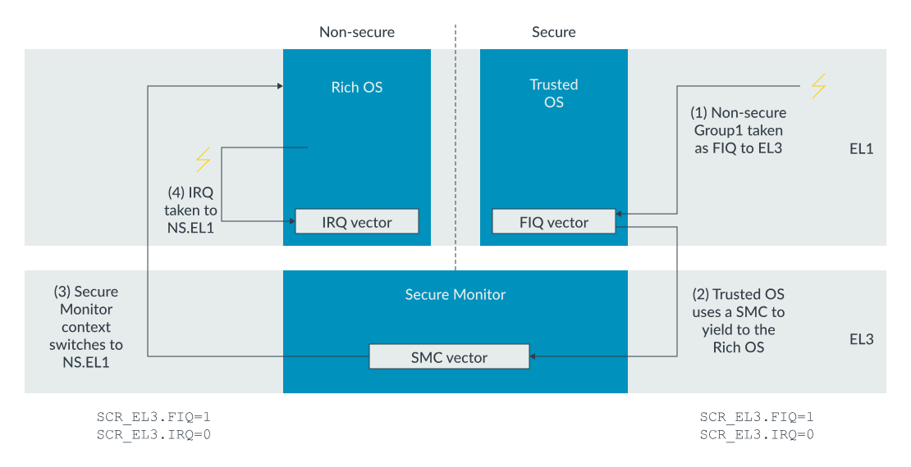

The steps involved in handling the interrupt are now as follows:

1. The modem interrupt becomes pending while the PE is executing the Trusted OS at Secure EL1. Because the modem interrupt is configured as `Non-secure Group 1`, it will be signaled as an FIQ. With SCR_EL3.FIQ==0, the exception is taken to Secure EL1.
> 按照这里的描述，上面的图片是有错误的，图片当中 SCR_EL3.FIQ == 1, 但是按照我们的这里的实际过程，应该是SCR_EL3.FIQ == 0, 这样的话，所有进入到monitor的过程就只能是通过 SMC 中断来实现了
2. The Trusted OS performs actions to tidy up its internal state. When it is ready, the Trusted OS uses an SMC instruction to yield to Non-secure state.
3. The SMC exception is taken to EL3. The Secure Monitor software executing at EL3 performs the necessary context switching operations.
4. Now that the PE is in Non-secure state, the interrupt is signaled as an IRQ and taken to Non-secure EL1 to be handled by the Rich OS.

### Running priority and preemption

The Priority Mask register sets the minimum priority that an interrupt must have to be forwarded to the PE. The GICv3 architecture also has the concept of a running priority. When a PE acknowledges an interrupt, its running priority becomes the same as the priority of the interrupt. The running priority returns to its former value when the PE writes to one of the End of Interrupt (EOI) registers. The following diagram shows an example the running priority of a PE over time:

Figure 3. Running priority value over time

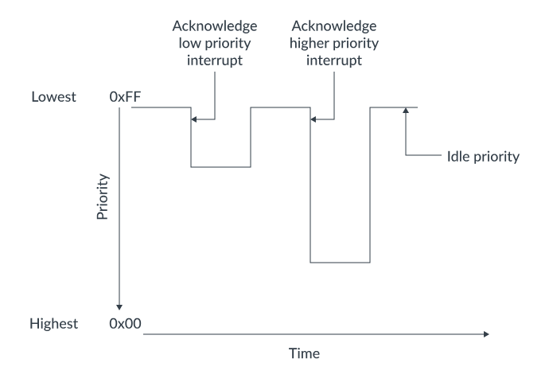

> 从上面的图中可以看出，running priority 的值是随着中断的处理而变化的，当一个中断被处理完毕之后，running priority 就会恢复到原来的值

The high priority interrupt is blocked until the previously signaled low priority interrupt is taken. Now consider the same situation, but with preemption enabled:

Figure 5. With preemption

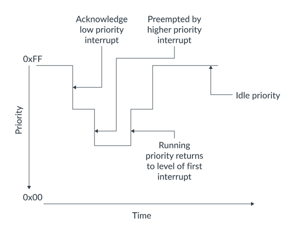

When the higher priority interrupt becomes pending, it preempts the previously signaled low priority interrupt. The preceding diagram shows one level of preemption. However, it is possible to have multiple levels of preemption.

The Arm CoreLink GICv3 architecture allows software to control preemption by specifying the difference in priority required for preemption to occur. This is controlled through the Binary Point registers: `ICC_BPRn_EL1`.

The Binary Point registers split the priority into two fields, `group priority` and `sub-priority`, as you can see here:

Figure 6. 8-bit priority value

For preemption, only the group priority bits are considered. The sub-priority bits are ignored.

For example, consider the following three interrupts:

INTID A has priority `0x10`.
INTID B has priority `0x20`.
INTID C has priority `0x21`.
In this example, we decided that:

A can preempt B or C.
B cannot preempt C, because B and C have similar priorities.

To achieve this, the split between Group and sub-priority could be set at N=4, as you can see here:

Figure 7. Group priority

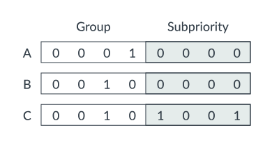

With this split, `B` and `C` now have the same priority for the purpose of preemption. However, A still has a higher priority, which means that it can preempt either B or C.

The Binary Point registers only affect preemption, that is, whether an interrupt should be signaled while already handling a different interrupt. When choosing between pending interrupts, the Binary Point registers are not used.

Note
Preemption requires that the interrupt handler, or handlers, are written to support nesting. Details of how to write such an interrupt handler are outside of the scope of this guide.

### End of interrupt

Once the interrupt has been handled, software must inform the interrupt controller that the interrupt has been handled, so that the state machine can transition to the next state. The Arm CoreLink GICv3 architecture treats this as two tasks:

- Priority drop

    This means dropping the running priority back to the value that it had before the interrupt was taken.

- Deactivation

    This means updating the state machine of the interrupt that is currently being handled. Typically, this will be a transition from the Active state to the Inactive state.

In the GICv3 architecture, priority drop and deactivation can happen together or separately. This is determined by the settings of `ICC_CTLR_ELn.EOImode`:

- EOImode = 0

A write to `ICC_EOIR0_EL1` for Group 0 interrupts, or `ICC_EOIR1_EL1` for Group 1 interrupts, performs both the priority drop and deactivation. This mode is often used for a simple bare metal environment.

- EOImode = 1

A write to `ICC_EOIR0_EL1` for Group 0 interrupts, or `ICC_EOIR1_EL1` for Group 1 interrupts results in a priority drop. A separate write to ICC_DIR_EL1 is required for deactivation. This mode is often used for virtualization purposes.

Most software will use EOIMode==0. EOImode==1 is most often used by hypervisors.

Checking the highest priority pending interrupt and running priority
As their names suggest, the Highest Priority Pending Interrupt registers, ICC_HPPIR0_EL1 and ICC_HPPIR1_EL1, report the INTID of the highest priority pending interrupt for a PE.

Running priority was introduced in Running priority and preemption, and is reported by the Running Priority register (ICC_RPR_EL1).

Checking the state of individual INTIDs
The Distributor provides registers that indicate the current state of each SPI. Similarly, the Redistributors provide registers that indicate the state of PPIs and SGIs for their connected PEs.

These registers can also move an interrupt to a specific state. This can be useful, for example, for testing that the configuration is correct without requiring the peripheral to assert the interrupt.

There are separate registers to report the active state and the pending state. The following table lists the active state registers. The pending state registers have the same format:

Register

Description

GICD_ISACTIVERn

Sets the active state for SPIs.

One bit for each INTID.

Reads of a bit return the current state of the INTID:

1 - The INTID is active.
0 - The INTID is not active.
Writing 1 to a bit activates the corresponding INTID.

Writing 0 to a bit has not effect.

GICD_ICACTIVERn

Clears the active state for SPIs.

One bit for each INTID.

Reads of a bit return the current state of the interrupt:

1 - The INTID is active.
0 - The INTID is not active.
Writing 1 to a bit activates the corresponding INTID.

Writing 0 to a bit has not effect.

GICR_ISACTIVERn

Sets the active state for SGIs and PPIs.

One bit for each INTID. This register covers INTIDs 0 to 31, which are private to each PE.

Reads of a bit return the current state of the interrupt:

1 - The INTID is active.
0 - The INTID is not active.
Writing 1 to a bit activates the corresponding INTID.

Writing 0 to a bit has not effect.

GICR_ICACTIVERn

Clears the active state for SGIs and PPIs.

One bit for each INTID. This register covers INTIDs 0 to 31, which are private to each PE.

Reads of a bit return the current state of the interrupt:

1 - The INTID is active.
0 - The INTID is not active.
Writing 1 to a bit activates the corresponding INTID.

Writing 0 to a bit has not effect.

Note
Software executing in Non-secure state cannot see the state of Group 0 or Secure Group 1 interrupts, unless access is permitted by GICD_NASCRn or GICR_NASCRn.

