## Overview

This guide introduces memory translation in AArch64, which is key to memory management. It explains how virtual addresses are translated to physical addresses, the translation table format, and how software manages the `Translation Lookaside Buffers (TLBs)`.

This information is useful for anyone who is developing low-level code, such as boot code or drivers. It is particularly relevant to anyone who is writing code to set up or manage the `Memory Management Unit (MMU)`.

At the end of this guide, you can check your knowledge. You will have learned how a virtual address is translated to a physical address. You will be able to name the different address spaces, and describe how the address spaces map onto the stages of translation. You will also have learned when software **must perform TLB maintenance**, and the syntax of TLB maintenance commands.

## What is memory management?

Memory management describes how access to memory in a system is controlled. The hardware performs memory management every time that memory is accessed by either the OS or applications. Memory management is a way of dynamically allocating regions of memory to applications.

### Why is memory management needed?

Application processors are designed to run a rich OS, such as Linux, and to support virtual memory systems. Software that executes on the processor only sees virtual addresses, which the processor translates into physical addresses. These physical addresses are presented to the memory system and point to the actual physical locations in memory.

## Virtual and physical addresses

The benefit of using virtual addresses is that it allows management software, such as an Operating System (OS), to control the view of memory that is presented to application software. The OS can control what memory is visible, the virtual address at which that memory is visible, and what accesses are permitted to that memory. This allows the OS to sandbox applications (hiding the resources of one application from another application) and to provide abstraction from the underlying hardware.

Another benefit of using virtual addresses is that an OS can present multiple fragmented physical regions of memory as a single, contiguous virtual address space to an application.

Virtual addresses also benefit software developers, who will not know a system's exact memory addresses when writing their application. With virtual addresses, software developers do not need to concern themselves with the physical memory. The application knows that it is up to the OS and the hardware to work together to perform the address translation.

In practice, each application can use its own set of virtual addresses that will be mapped to different locations in the physical system. As the operating system switches between different applications it re-programs the map. This means that the virtual addresses for the current application will map to the correct physical location in memory.

Virtual addresses are translated to physical addresses through mappings. The mappings between virtual addresses and physical addresses are stored in `translation tables` (sometimes referred to as `page tables`) as this diagram shows:

Figure 1. A diagram showing virtual and physical addresses

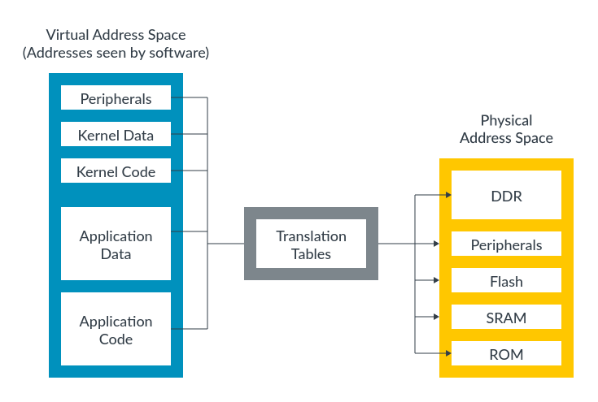

Translation tables are in memory and are managed by software, typically an OS or hypervisor. The translations tables are not static, and the tables can be updated as the needs of software change. This changes the mapping between virtual and physical addresses.

## Address spaces

There are several independent virtual address spaces in AArch64. This diagram shows some of these virtual address spaces:

Figure 1. Address spaces in Armv8-A

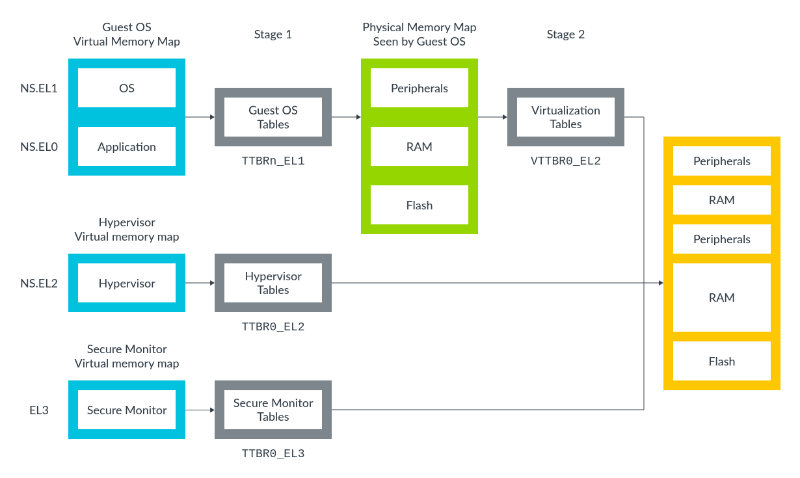

The diagram shows three virtual address spaces:

- Non-secure EL0 and EL1.
- Non-secure EL2.
- EL3.

Each of these virtual address spaces is independent, and has its own settings and tables. We often call these settings and tables `‘translation regimes'`. There are also virtual address spaces for Secure EL0, Secure EL1 and Secure EL2, but they are not shown in the diagram.

> Note<br>Support for Secure EL2 (FEAT_SEL2) was added in Armv8.4-A.

Because there are multiple virtual address spaces, it is important to specify which address space an address is in. For example, `NS.EL2:0x8000` refers to the address `0x8000` in the `Non-secure EL2` virtual address space.

The diagram also shows that the virtual addresses from Non-secure EL0 and Non-secure EL1 go through `two stages` of translation. These tables support virtualization and allow the hypervisor to virtualize the view of physical memory that is seen by a virtual machine (VM).

Armv9-A supports all the virtual addresses spaces described above for Armv8-A. Armv9-A introduces the optional Realm Management Extension (RME). When RME is implemented, additional translation regimes are also present:

- Realm EL1 and EL0
- Realm EL2 and EL0
- Realm EL2

In virtualization, we call the set of translations that are controlled by the OS, Stage 1. The Stage 1 tables translate virtual addresses to intermediate physical addresses (IPAs). In Stage 1 the OS thinks that the IPAs are physical address spaces. However, the hypervisor controls a second set of translations, which we call Stage 2. This second set of tables translates IPAs to physical addresses. This diagram shows how the two sets of translations work:

Figure 2. Stage 2 IPAs to physical addresses
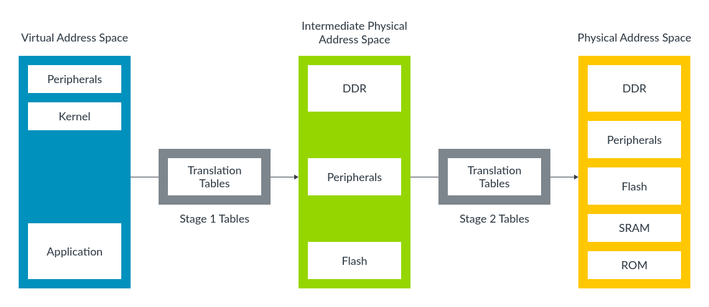

Although there are some minor differences in the table format, the process of Stage 1 and Stage 2 translation is usually the same.

> Note<br>At Arm, we use the address 0x8000 in many of our examples. 0x8000 is also the default address for linking with the Arm linker, armlink. The address comes from an early microcomputer, the BBC Micro Model B, which had ROM (and sideways RAM) at the address 0x8000. The BBC Micro Model B was built by a company called Acorn, which developed the Acorn RISC Machine (ARM), and later became Arm.

### Physical Addresses

As well as multiple virtual address spaces, AArch64 also has multiple `physical address spaces` (PAS):

- Non-secure PAS
- Secure PAS
- Realm PAS (Armv9-A only)
- Root PAS (Armv9-A only)

Which physical address space, or spaces, a virtual address can be mapped to depends on the current Security state of the processor. The following list shows the Security states with its corresponding virtual address mapping destinations:

- Non-secure state: virtual addresses can only map to Non-secure physical addresses.
- Secure state: virtual addresses can map to Secure or Non-secure physical addresses.
- Realm state: virtual addresses can map to Realm or Non-secure physical addresses.
- Root state: virtual address can map to any physical address space.

When the PE is in a Security state that can access multiple physical address spaces, the translation table entries control which output physical address space is used. The following diagram shows the mapping of multiple physical address spaces:

Figure 1. Mapping of multiple physical address spaces

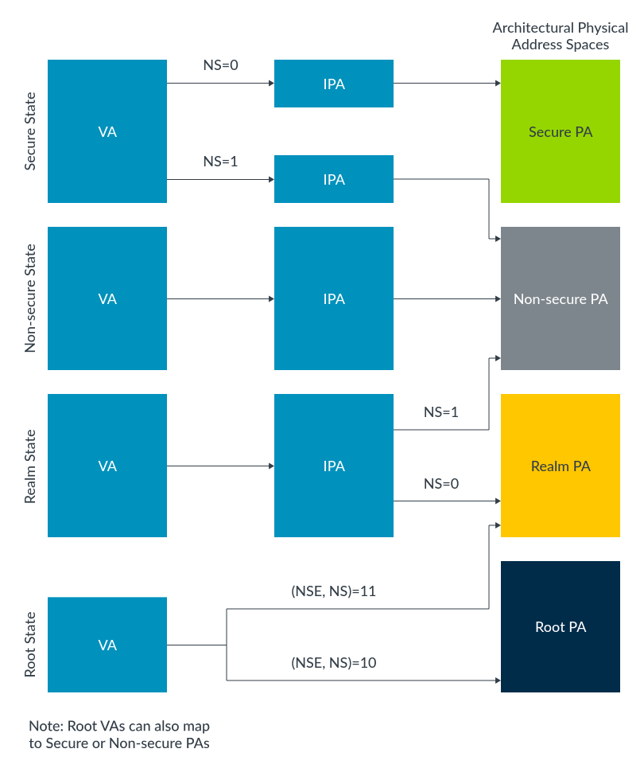

### Address sizes

AArch64 is a 64-bit architecture, but this does not mean that all addresses are 64-bit.

### Size of virtual addresses

Virtual addresses are stored in a 64-bit format. As a result, the address in load instructions (LDR) and store instructions (STR) is always specified in an X register. However, not all of the addresses in the X register are valid.

This diagram shows the layout of the virtual address space in AArch64:

Figure 1. Size of virtual addresses

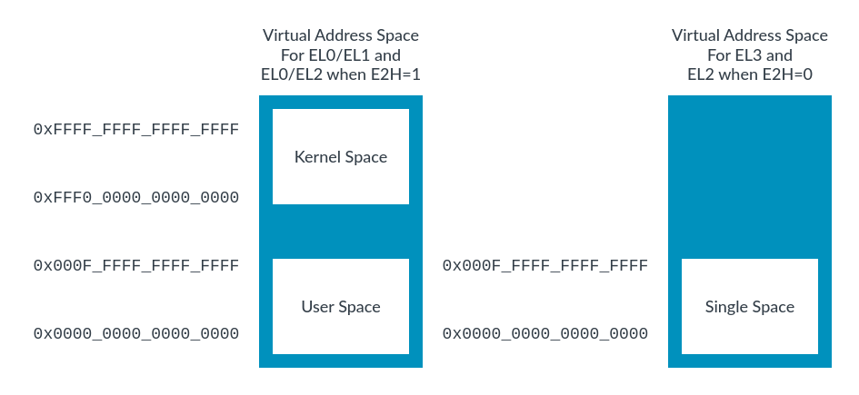

> 我们是否可以理解为地址空间和EL等级没有关系，也就是说EL0/EL1使用的都是同一个virtual address space

There are two regions for the EL0/EL1 virtual address space: by convention, they are used as kernel space and application space. These two regions are shown on the left-hand side of the diagram, with kernel space at the top, and application space, which is labelled ‘User space', at the bottom of the address space. Kernel space and user space have `separate translation tables` and this means that their mappings can be kept separate.

There is a single region at the bottom of the address space for all other Exception levels. This region is shown on the right-hand side of the diagram and is single space box.

> Note<br>If you set HCR_EL2.E2H to 1 it enables a configuration where a host OS runs in EL2, and the applications of the host OS run in EL0. In this scenario, EL2 also has an upper and a lower region.

Each region of address space has a size of up to `55-bits`. However, each region can be independently shrunk to a smaller size. The `TnSZ` fields in the `TCR_ELx` registers control the size of the virtual address space. For example, this diagram shows that `TCR_EL1` controls the EL0/EL1 virtual address space:

Figure 2. Virtual address space

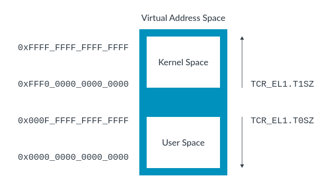

The virtual address size is encoded as:

```
virtual address size in bytes = 2^(64-TCR_ELx.TnSZ)
```

The virtual address size can also be expressed as a number of address bits:

```
Number of address bits = 64 - TnSZ
```

Therefore, if `TCR_EL1.T1SZ` is set to 32, the size of the kernel region in the EL0/EL1 virtual address space is `2^32` bytes (0xFFFF_FFFF_0000_0000 to 0xFFFF_FFFF_FFFF_FFFF). Any address that is outside of the configured range or ranges will, when it is accessed, generate an exception as a translation fault. The advantage of this configuration is that we only need to describe as much of the address space as we want to use, which saves time and space. For example, imagine that the OS kernel needs 1GB of address space (30-bit address size) for its kernel space. If the OS sets T1SZ to 34, then only the translation table entries to describe 1GB are created, as 64 - 34 = 30.

> Note<br>All Armv8-A implementations support 48-bit virtual addresses. Support for 52-bit or 56-bit virtual addresses is optional and reported by `ID_AA64MMFR2_EL1`. At the time of writing, none of the Arm Cortex-A processors support 52-bit virtual addresses.

### Size of physical addresses

The size of a physical address is IMPLEMENTATION DEFINED, up to a maximum of 56 bits. The `ID_AA64MMFR0_EL1` register reports the size that is implemented by the processor. For Arm Cortex-A processors, this will usually be 40 bits or 44 bits.

> Note<br>In Armv8.0-A, the maximum size for a physical address is 48 bits. This was extended to 56 bits in Armv9.3-A.

### Size of intermediate physical addresses

If you specify an output address in a translation table entry that is larger than the implemented maximum, the Memory Management Unit (MMU) will generate an exception as an address size fault.

The size of the IPA space can be configured in the same way as the virtual address space. VTCR_EL2.T0SZ controls the size. The maximum size that can be configured is the same as the physical address size that is supported by the processor. This means that you cannot configure a larger IPA space than the supported physical address space.

### Address Space Identifiers - Tagging translations with the owning process

Many modern OSs have applications that all seem to run from the same address region, this is what we have described as user space. In practice, different applications require different mappings. This means, for example, that the translation for VA 0x8000 depends on which application is currently running.

Ideally, we would like the translations for different applications to coexist within the `Translation Lookaside Buffers (TLBs)`, to **prevent the need for TLB invalidates on a context switch**. But how would the processor know which version of the VA 0x8000 translation to use? In AArch64, the answer is `Address Space Identifiers (ASIDs)`.

For the EL0/EL1 virtual address space, translations can be marked as `Global (G)` or `Non-Global (nG)` using the `nG` bit in the attributes field of the translation table entry. For example, kernel mappings are `Global translations`, and application mappings are `Non-Global translations`. Global translations apply to whichever application is currently running. Non-Global translations only apply to a specific application.

Non-Global mappings are tagged with an `ASID` in the TLBs. On a TLB lookup, the ASID in the TLB entry is compared with the currently selected ASID. If they do not match, then the TLB entry is not used. This diagram shows a Global mapping in the kernel space with no ASID tag and a non-Global mapping in user space with an ASID tag:

Figure 1. Translation look-aside buffer

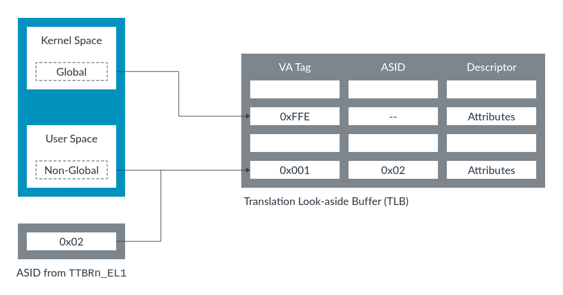

The diagram shows that TLB entries for multiple applications are allowed to coexist in the cache, and the ASID determines which entry to use.

The ASID is stored in one of the two `TTBRn_EL1` registers. Usually TTBR0_EL1 is used for user space. As a result, a single register update can change both the ASID and the translation table that it points to.

In 2023 Arm introduced the ability to specify two ASIDs simultaneously. From Armv9.5-A, software has the option to use the ASID field in both `TTBRn_EL1` registers simultaneously. `TTBR0_EL1.ASID` is applied to addresses in the lower portion of the virtual address space and `TTBR1_EL1.ASID` to addresses in the upper portion of the virtual address space.

> Note<br>ASID tagging is also available in EL2, when HCR_EL2.E2H==1.

### Virtual Machine Identifiers - Tagging translations with the owning VM

EL0/EL1 translations can also be tagged with a `Virtual Machine Identifier (VMID)`. VMIDs allow translations from different VMs to coexist in the cache. This is similar to the way in which ASIDs work for translations from different applications. In practice, this means that some translations will be tagged with both a VMID and an ASID, and that both must match for the TLB entry to be used.

> Note<br>When virtualization is supported for a security state, EL0/EL1 translations are always tagged with a VMID - even if Stage 2 translation is not enabled. This means that if you are writing initialization code and are not using a hypervisor, it is important to set a known VMID value before setting up the Stage 1 MMU.

### Common not Private

If a system includes multiple processors, do the ASIDs and VMIDs used on one processor have the same meaning on other processors?

For Armv8.0-A the answer is that they do not have to mean the same thing. There is no requirement for software to use a given ASID in the same way across multiple processors. For example, ASID 5 might be used by the calculator on one processor and by the web browser on another processor. This means that a TLB entry that is created by one processor cannot be used by another processor.

In practice, it is unlikely that software will use ASIDs differently across processors. It is more common for software to use ASIDs and VMIDs in the same way on all processors in a given system. Therefore, Armv8.2-A introduced the `Common not Private (CnP)` bit in the `Translation Table Base Register (TTBR)`. When the CnP bit is set, the software promises to use the ASIDs and VMIDs in the same way on all processors, which allows the TLB entries that are created by one processor to be used by another.

> Note<br>We have been talking about processors, however, technically, we should be using the term, Processing Element (PE). PE is a generic term for any machine that implements the Arm architecture. It is important here because there are microarchitectural reasons why sharing TLBs between processors would be difficult. But within a multithreaded processor, where each hardware thread is a PE, it is much more desirable to share TLB entries.

> 也就是说不同的processor是不会共享TLB的，即每个processor 都会有自己的TLB，因此如果是从processor的角度来看的话，那么我们就不需要考虑跨processor之间共享ASID的问题;<br>但是对于PE来说不是这样，因为一个processor当中可能存在多个PE，也就是说2个PE可能会共享同一个TLB，因此站在PE的角度来看的话，我们就需要考虑ASID的问题了

## The Memory Management Unit (MMU)

The Memory Management Unit (MMU) is responsible for the translation of virtual addresses used by software to physical addresses used in the memory system.

The MMU contains the following:

- The table walk unit, which contains logic that reads the translation tables from memory.
- Translation Lookaside Buffers (TLBs), which cache recently used translations.

> TLB和cache还是需要区分好，TLB当中存储的是翻译好的地址，Cache当中存储的就直接是内存当中的内容了，即一个是地址，一个是地址当中的内容

All memory addresses that are issued by software are virtual. These memory addresses are passed to the MMU, which checks the TLBs for a recently used cached translation. If the MMU does not find a recently cached translation, the table walk unit reads the appropriate table entry, or entries, from memory, as shown here:

Figure 1. A diagram showing The MMU

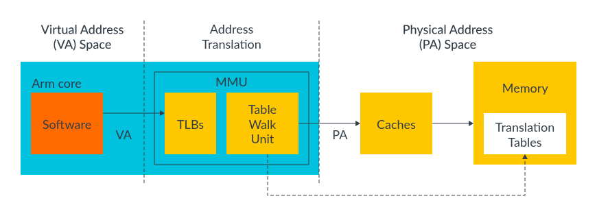

A virtual address must be translated to a physical address before a memory access can take place (because we must know which physical memory location we are accessing). This need for translation also applies to cached data, because on Armv6 and later processors, the data caches store data using the physical address (addresses that are physically tagged). Therefore, the address must be translated before a cache lookup can complete.

> Note<br>Architecture is a behavioural specification. The caches must behave as if they are physically tagged. An implementation might do something different, as long as this is not software-visible.

### Table entry

The translation tables work by dividing the virtual address space into equal-sized blocks and by providing one entry in the table per block.

`Entry 0` in the table provides the mapping for `block 0`, entry 1 provides the mapping for block 1, and so on. Each entry contains the address of a corresponding block of physical memory and the attributes to use when accessing the physical address.

Figure 1. A diagram showing table entry

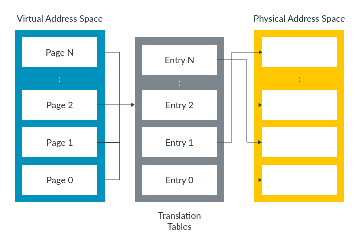

### Table lookup

A table lookup occurs when a translation takes place. When a translation happens, the virtual address that is issued by the software is split in two, as shown in this diagram:

Figure 1. A diagram showing table look-up

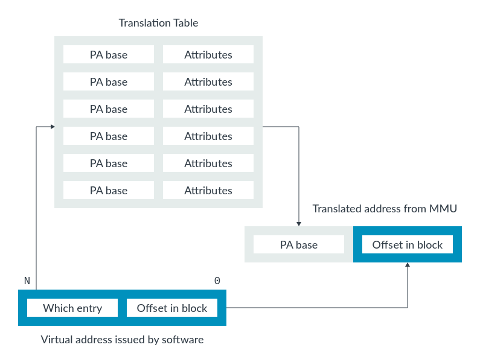

This diagram shows a `single-level` lookup.

The upper-order bits, which are labelled ‘Which entry' in the diagram, tell you which block entry to look in and they are used as an index into the table. This entry block contains the physical address for the virtual address.

The lower-order bits, which are labelled ‘Offset in block' in the diagram, are an offset within that block and are not changed by the translation.

### Multilevel translation

In a single-level lookup, the virtual address space is split into `equal-sized blocks`. In practice, a hierarchy of tables is used.

The first table (Level 1 table) divides the virtual address space into large blocks. Each entry in this table can point to an equal-sized block of physical memory or it can point to another table which subdivides the block into smaller blocks. We call this type of table a ‘multilevel table'. Here we can see an example of a multilevel table that has three levels:

Figure 1. A diagram showing multilevel translation

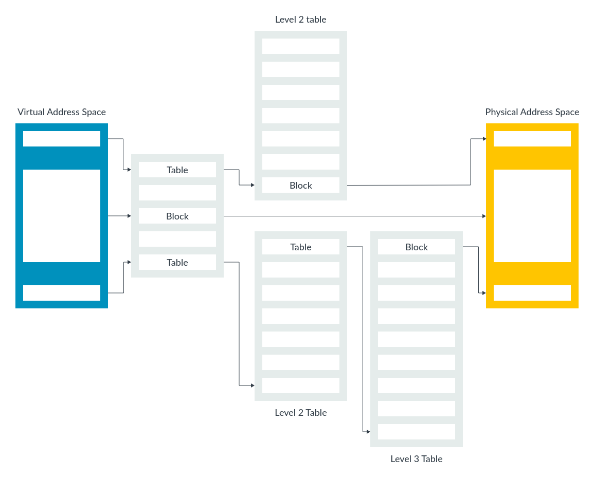

In Armv8-A, the maximum number of levels is six, and the levels are numbered -2 to 3. This multilevel approach allows both larger blocks and smaller blocks to be described. The characteristics of large and small blocks are as follows:

- Large blocks require fewer levels of reads to translate than small blocks. Plus, large blocks are more efficient to cache in the TLBs.
- Small blocks give software fine-grain control over memory allocation. However, small blocks are less efficient to cache in the TLBs. Caching is less efficient because small blocks require multiple reads through the levels to translate.
To manage this trade-off, an OS must balance the efficiency of using large mappings against the flexibility of using smaller mappings for optimum performance.

> Note<br>The processor does not know the size of the translation when it starts the table lookup. The processor works out the size of the block that is being translated by performing the table walk.

> 以 Armv8-A 最常见的 4KB 页面粒度、39 位虚拟地址（512GB 空间）为例：

> 假设 TTBR0_EL1 指向了 Level 1 页表的基地址。
> CPU 发出的虚拟地址 (VA) 被分成四部分：

> - `[38:30]` (9 bits)：索引 Level 1 表。硬件读取该条目。

>   - 1. 如果该条目标记为"Block"（块），则直接得到物理地址（覆盖 1GB），查找结束。
>   - 2. 如果标为"Table"（表），则继续。

> - `[29:21]` (9 bits)：索引 Level 2 表。硬件读取该条目。

>   - 1. 如果该条目标记为"Block"，则得到物理地址（覆盖 2MB），查找结束。
>   - 2. 如果标为"Table"，则继续。

> - `[20:12]` (9 bits)：索引 Level 3 表。硬件读取该条目。

>   - 1. 这里必须是"Page"（页）描述符。

> - `[11:0]` (12 bits)：页内偏移。直接加到得到的物理页基址上。

-------------------------------

## Controlling address translation Translation table format

Here we can see the different formats that are allowed for translation table entries:

Figure 1. Translation table format

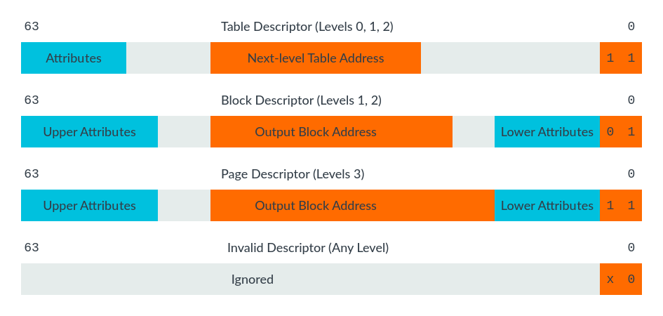

> Note<br>For purposes of clarity, this diagram does not specify the width of bit fields. You can find this information in the Arm Architecture Reference Manual Armv8, for Armv8-A architecture profile: The VMSAv8-64 translation table format descriptors.

Each entry is 64 bits and the bottom two bits determine the type of entry.

Notice that some of the table entries are only valid at specific levels. The maximum number of levels of tables is four, which is why there is no table descriptor for level 3 (or the fourth level), tables. Similarly, there are no Block descriptors or Page descriptors for level 0. Because level 0 entry covers a large region of virtual address space, it does not make sense to allow blocks.

> Note<br>The encoding for the Table descriptor at levels 0-2 is the same as the Page descriptor at level 3. This encoding allows ‘recursive tables', which point back to themselves. This is useful because it makes it easy to calculate the virtual address of a particular page table entry so that it can be updated.

## Translation granule

A translation granule is the smallest block of memory that can be described. Nothing smaller can be described, only larger blocks, which are multiples of the granule.

AArch64 supports three different granule sizes: 4KB, 16KB, and 64KB.

The granule sizes that a processor supports are IMPLEMENTATION DEFINED and are reported by `ID_AA64MMFR0_EL1`. All Arm Cortex-A processors support 4KB and 64KB. The selected granule is the smallest block that can be described in the last level table. Larger blocks can also be described. This table shows the different block sizes for each level of table based on the selected granule:

| Level of table | 4KB granule | 4KB granule | 16KB granule | 16KB granule | 64KB granule | 64KB granule |
| --- | --- | --- | --- | --- | --- | --- |
| | Size per entry | Bits used to index | Size per entry | Bits used to index | Size per entry | Bits used to index |
| 0 | 512GB | 47:39 | 128TB | 47    | –     | –     |
| 1 | 1GB   | 38:30 | 64GB  | 46:36 | 4TB   | 51:42 |
| 2 | 2MB   | 29:21 | 32MB  | 35:25 | 512MB | 41:29 |
| 3 | 4KB   | 20:12 | 16KB  | 24:14 | 64KB  | 28:16 |


Before the introduction of Armv9.2-A and Armv8.7-A, there were restrictions on using 52-bit addresses. When the selected granule is 4KB or 16KB, the maximum virtual address region size is 48 bits. Similarly, output physical addresses are limited to 48 bits. It is only when the 64KB granule is used that the full 52 bits can be used.

> Note<br>TCR_EL1 has two separate fields that control the granule size for the kernel space and the user space virtual address ranges. These fields are called TG1 for kernel space and TG0 for user space. A potential problem for programmers is that these two fields have different encodings.

### The starting level of address translation
Together, the granule and the size of the virtual address space control the starting level of address translation.

The previous table summarized the block size (size of virtual address range covered by a single entry) for each granule at each level of table. From the block size, you can work out which bits of the virtual address are used to index each level of table.

Let us take the 4KB granule as an example. This diagram shows the bits that are used to index the different levels of table for a 4KB granule:

Figure 1. Starting level of translation

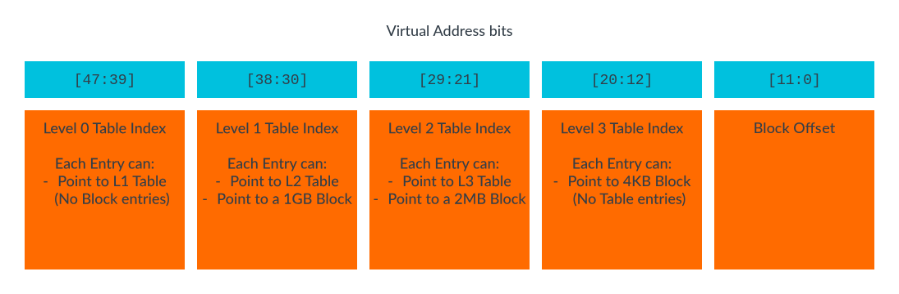


-----------------------------------------

作为ARM架构专家，我将从**操作系统内核开发者**的视角，为你完整梳理ARMv8-A多级页表的软件视角实现细节。

## 一、核心数据结构：页表的组织方式

### 1. 页表项的格式
在ARMv8-A中，每个页表项（PTE）都是 **64位** 的。操作系统需要理解这64位的布局：

```c
// Linux内核中对于ARM64页表项的定义 (arch/arm64/include/asm/pgtable-types.h)
typedef struct { pteval_t pte; } pte_t;

// pteval_t 本质上是 unsigned long (64位)
```

**关键位域含义（以4KB页面为例）：**

```
位[63:50] : 地址扩展或RES0（取决于配置）
位[47:12] : 物理页帧号（PFN）- 这是最关键的部分，指向物理页的基地址
位[11]    : PXN（特权执行永不） - 阻止EL1执行该区域的代码
位[10]    : UXN（用户执行永不） - 阻止EL0执行该区域的代码
位[7:6]   : AP[2:1]（访问权限）- 控制读写权限
位[5]     : NS（非安全）- 安全世界配置
位[4]     : AF（访问标志）- 硬件会置位，OS用于页面回收
位[2]     : 属性索引 - 指向MAIR寄存器中的内存属性
位[1]     : 可读/脏页管理位
位[0]     : 有效位（最重要的！0表示无效，1表示有效）
```

### 2. 多级页表的树形结构

从OS角度看，多级页表是一棵**多叉树**。以标准的4KB页面、39位VA为例：

```c
// 页表级数: 3级 (Level 0, 1, 2, 3 中的后三级)
// 但ARM文档通常从1开始计数，这里用Linux内核的视角

struct page_table_tree {
    pgd_t *pgd;        // PGD (Page Global Directory) - Level 1 (对应ARM的Level 1)
    pud_t *pud;        // PUD (Page Upper Directory) - Level 2 (对应ARM的Level 2)
    pmd_t *pmd;        // PMD (Page Middle Directory) - 如果使用大页，这里可能是块描述符
    pte_t *pte;        // PTE (Page Table Entry) - Level 3 (最后一级，必须是页)
};
```

## 二、操作系统初始化流程

### 1. TTBR的初始化

操作系统在启动时（通常在汇编代码阶段）设置页表基址寄存器：

```assembly
// Linux内核启动代码片段 (arch/arm64/kernel/head.S)
init_mm_context:
    // 计算swapper_pg_dir的物理地址（内核主内核页表）
    adrp    x0, swapper_pg_dir
    // 设置TTBR0_EL1（用户空间页表基址）
    msr     ttbr0_el1, x0
    // 设置TTBR1_EL1（内核空间页表基址）
    msr     ttbr1_el1, x0
    
    // 配置TCR（Translation Control Register）
    ldr     x0, =TCR_T0SZ(VA_BITS) | TCR_T1SZ(VA_BITS) | TCR_ASID_16
    msr     tcr_el1, x0
    
    // 设置MAIR（内存属性）
    ldr     x0, =MAIR_ATTRS
    msr     mair_el1, x0
```

关键点：**ARMv8-A使用TTBR0_EL1和TTBR1_EL1分开管理用户和内核页表**：
- **TTBR0_EL1**: 用户空间（虚拟地址高位为0）
- **TTBR1_EL1**: 内核空间（虚拟地址高位为1）

### 2. MAIR的配置

MAIR定义了页表项中属性索引对应的实际内存类型：

```c
// Linux内核设置 (arch/arm64/include/asm/sysreg.h)
#define MAIR_ATTRS                                                     \
    (MAIR_ATTRIDX(MAIR_ATTR_DEVICE_nGnRnE, MT_DEVICE_nGnRnE) |        \
     MAIR_ATTRIDX(MAIR_ATTR_NORMAL_NC, MT_NORMAL_NC) |                \
     MAIR_ATTRIDX(MAIR_ATTR_NORMAL, MT_NORMAL) |                      \
     MAIR_ATTRIDX(MAIR_ATTR_NORMAL_WT, MT_NORMAL_WT))

// 这告诉硬件：
// 索引0: 设备内存（严格排序）
// 索引1: 普通内存，非缓存
// 索引2: 普通内存，可缓存（写回）
// 索引3: 普通内存，写透
```

## 三、地址翻译的完整过程

### 场景：用户程序访问地址 0x7f8a4b2c 1000

假设：
- 4KB页面
- 39位虚拟地址空间
- ASID = 42
- VMID = 1（如果虚拟化开启）

### Step 1: MMU硬件解析虚拟地址

虚拟地址 `0x7f8a4b2c1000` 的二进制分解：

```
63           48 47         39 38         30 29         21 20         12 11          0
+-------------+-------------+-------------+-------------+-------------+-------------+
|    sign     |     L0      |     L1      |     L2      |     L3      |   offset    |
|  扩展(未使用) |  (9 bits)   |  (9 bits)   |  (9 bits)   |  (9 bits)   |  (12 bits)  |
+-------------+-------------+-------------+-------------+-------------+-------------+
                                   ↓              ↓              ↓            ↓
                                索引 0x12      索引 0x45      索引 0x78    偏移 0x000
```

### Step 2: TLB查找

MMU首先进行TLB查找：

```c
// TLB条目的逻辑结构（对OS透明）
struct tlb_entry {
    uint64_t virtual_tag;      // 虚拟地址标签（包含ASID/VMID）
    uint64_t physical_address; // 物理地址
    uint64_t attributes;       // 内存属性、权限
    uint64_t va_range;         // 地址范围大小（4KB/2MB/1GB）
};

// 查找过程
tlb_lookup_result = tlb_search(0x7f8a4b2c1000, asid=42, vmid=1);
if (tlb_hit) {
    // TLB命中：直接从TLB条目获取物理地址，无需页表遍历
    goto access_memory;
}
```

### Step 3: 页表遍历（TLB未命中）

如果TLB未命中，MMU硬件开始遍历页表（这个过程对OS透明，但OS必须正确建立页表）：

```c
// 以下代码模拟硬件遍历过程（实际是硬件逻辑）
phys_addr_t walk_page_table(uint64_t va, uint64_t ttbr, int el_level) {
    // 从TTBR获取L1表基址
    uint64_t *l1_table = phys_to_virt(ttbr & 0xfffffffff000);
    
    // L1索引 (VA[38:30])
    int l1_idx = (va >> 30) & 0x1FF;
    
    // 读取L1条目
    uint64_t l1_entry = l1_table[l1_idx];
    
    // 检查L1条目类型
    if (l1_entry & 0x3 == 0x1) {
        // 块描述符（Block Descriptor）- 2MB或1GB
        // 这表示L1直接指向物理块
        uint64_t block_base = l1_entry & 0xfffffc0000000000; // 1GB对齐
        uint64_t offset_in_block = va & ((1 << 30) - 1); // 1GB内的偏移
        return block_base + offset_in_block;
    }
    else if (l1_entry & 0x3 == 0x3) {
        // 表描述符（Table Descriptor）- 继续下一级
        uint64_t *l2_table = phys_to_virt(l1_entry & 0xfffffffff000);
        
        // L2索引 (VA[29:21])
        int l2_idx = (va >> 21) & 0x1FF;
        uint64_t l2_entry = l2_table[l2_idx];
        
        if (l2_entry & 0x3 == 0x1) {
            // L2块描述符 - 2MB块
            uint64_t block_base = l2_entry & 0xfffffffff00000; // 2MB对齐
            uint64_t offset_in_block = va & ((1 << 21) - 1); // 2MB内的偏移
            return block_base + offset_in_block;
        }
        
        // 继续到L3...
        uint64_t *l3_table = phys_to_virt(l2_entry & 0xfffffffff000);
        int l3_idx = (va >> 12) & 0x1FF;
        uint64_t l3_entry = l3_table[l3_idx];
        
        // L3必须是页描述符
        if ((l3_entry & 0x3) == 0x3) {
            uint64_t page_base = l3_entry & 0xfffffffff000; // 4KB对齐
            uint64_t offset = va & 0xFFF; // 4KB内的偏移
            return page_base + offset;
        }
    }
    
    // 无效映射 -> 触发缺页异常
    handle_page_fault(va);
}
```

### Step 4: 缺页异常处理

当页表遍历遇到无效条目时，CPU触发缺页异常，OS接管：

```c
// Linux内核缺页异常处理 (arch/arm64/mm/fault.c)
void do_page_fault(struct pt_regs *regs, unsigned long far, int esr) {
    // far: 出错的虚拟地址 (Fault Address Register)
    // esr: 异常综合征寄存器，包含错误原因
    
    struct mm_struct *mm = current->mm;
    struct vm_area_struct *vma;
    
    // 1. 查找出错的地址属于哪个VMA
    vma = find_vma(mm, far);
    if (!vma) {
        // 段错误：该地址不在任何VMA中
        force_sig_fault(SIGSEGV, SEGV_MAPERR, far);
        return;
    }
    
    // 2. 检查访问权限
    if (esr & ESR_ELx_WRITE) {  // 写操作
        if (!(vma->vm_flags & VM_WRITE)) {
            // 写只读页面 -> 可能是写时复制
            if (vma->vm_flags & VM_SHARED) {
                // 共享映射的处理
            } else {
                // 私有映射 -> 触发写时复制
                do_cow_page_fault(regs, far, vma);
            }
            return;
        }
    }
    
    // 3. 分配物理页面并建立页表
    handle_pte_fault(vma, far, flags);
}
```

### Step 5: 页表的建立（缺页处理的核心）

```c
// Linux内核建立页表的过程
void set_pte_at(struct mm_struct *mm, unsigned long addr,
                pte_t *ptep, pte_t pte) {
    // 1. 获取要设置的页表项指针
    // 2. 构造pte值
    pte_val = (pfn << PAGE_SHIFT) |  // 物理页帧号
              (access_flags << 6) |   // 权限位
              (attr_index << 2) |     // 内存属性（对应MAIR）
              PTE_AF |                 // 硬件会置位的访问标志
              PTE_VALID;                // 有效位
    
    // 3. 写入页表
    *ptep = __pte(pte_val);
    
    // 4. 清空TLB中对应的旧条目（TLB维护）
    if (system_uses_ttbr0_pan()) {
        flush_tlb_kernel_range(addr, addr + PAGE_SIZE);
    } else {
        flush_tlb_mm_range(mm, addr, addr + PAGE_SIZE);
    }
}
```

## 四、TLB的维护（OS的核心职责）

TLB是页表的硬件缓存，OS必须正确维护其一致性：

### 1. 什么时候需要TLB维护？

```c
// 场景1: 进程切换（切换地址空间）
void switch_mm(struct mm_struct *prev, struct mm_struct *next) {
    // 写TTBR0_EL1，同时硬件会刷洗TLB（取决于TCR配置）
    cpu_switch_mm(next->pgd, next);
    
    // 或使用ASID优化：
    // 如果支持ASID，只需要写TTBR0_EL1并设置新的ASID
    // 硬件会自动区分TLB条目属于哪个进程
}

// 场景2: 解除映射
void unmap_page_range(struct mmu_gather *tlb, unsigned long addr) {
    // 清除页表项
    pte_clear(mm, addr, pte);
    
    // 必须使对应的TLB条目无效
    flush_tlb_page(vma, addr);
}

// 场景3: 修改权限（如写时复制）
void ptep_set_wrprotect(struct mm_struct *mm, unsigned long addr, pte_t *ptep) {
    pte_t old_pte = *ptep;
    
    // 清除写权限位
    set_pte_at(mm, addr, ptep, pte_wrprotect(old_pte));
    
    // 必须刷洗TLB，否则CPU可能还认为有写权限
    flush_tlb_page(vma, addr);
}
```

### 2. TLB维护指令

ARM提供了多种TLB维护指令：

```assembly
// 使整个TLB无效
tlbi vmalle1is            // 使EL1&0所有的TLB条目无效

// 使指定ASID的TLB条目无效
tlbi aside1is, x0         // x0包含ASID

// 使指定VA的TLB条目无效
tlbi vaae1is, x0          // x0包含VA和ASID

// 使指定VMID的TLB条目无效（虚拟化场景）
tlbi ipas2e1is, x0        // x0包含IPA和VMID

// 必须执行DSB来确保TLBI完成
dsb ish
```

## 五、大页处理优化

操作系统会尝试使用大页以减少TLB压力：

```c
// 透明大页的合并过程
int __pmd_alloc(struct mm_struct *mm, pud_t *pud, unsigned long addr) {
    // 如果条件允许，尝试分配2MB的大页
    if (try_to_merge_to_hugepage(mm, addr)) {
        // 建立PMD级别的块描述符，而不是PTE页表
        pmd_t entry = __pmd((phys_addr << 21) |   // 2MB对齐的物理地址
                            PMD_TYPE_SECT |        // 标记为块描述符
                            PMD_SECT_AF |           // 访问标志
                            prot);
        set_pmd(pmd, entry);
        
        // 刷洗TLB
        flush_tlb_range(vma, addr, addr + HPAGE_SIZE);
        return 0;
    }
    
    // 否则，分配PTE页表
    return normal_pte_alloc(mm, pud, addr);
}
```

## 六、调试和观察

你可以通过以下方式观察页表：

```bash
# 查看进程的内存映射
cat /proc/self/maps

# 查看页表信息
cat /proc/self/pagemap

# 使用Linux内核的debugfs
mount -t debugfs none /sys/kernel/debug
cat /sys/kernel/debug/kernel_page_tables

# 使用KVM工具查看虚拟机的页表
kvm_stat
```

## 总结

从操作系统角度看，多级页表是一个**用空间换时间、用复杂换灵活**的系统：

1. **数据结构**：树形结构，以4KB为基础，支持大页
2. **初始化**：配置TTBR、TCR、MAIR
3. **运行时**：TLB是性能关键，OS需要精心维护
4. **维护**：TLB刷洗是重要但昂贵的操作，需要尽量减少
5. **优化**：使用大页、ASID、VMID等技术提升性能

理解这些细节，对于优化系统性能、调试内存相关问题至关重要。

